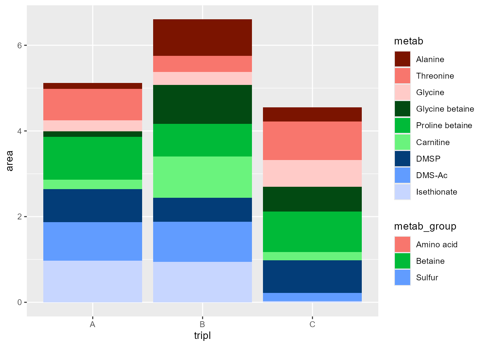
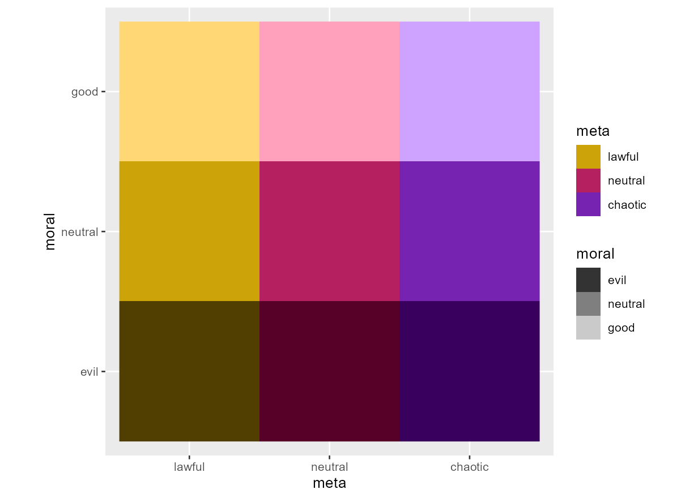
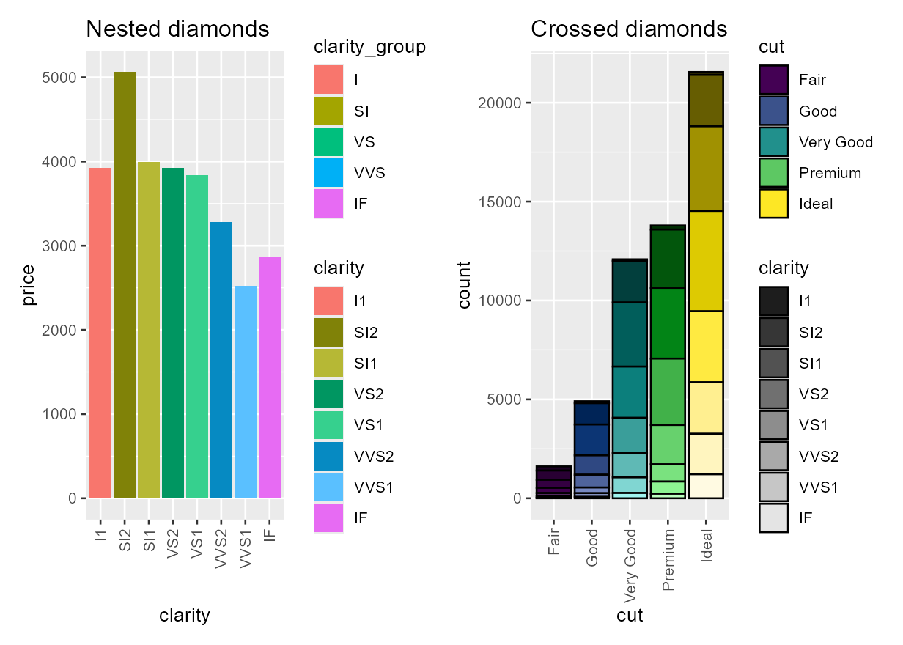
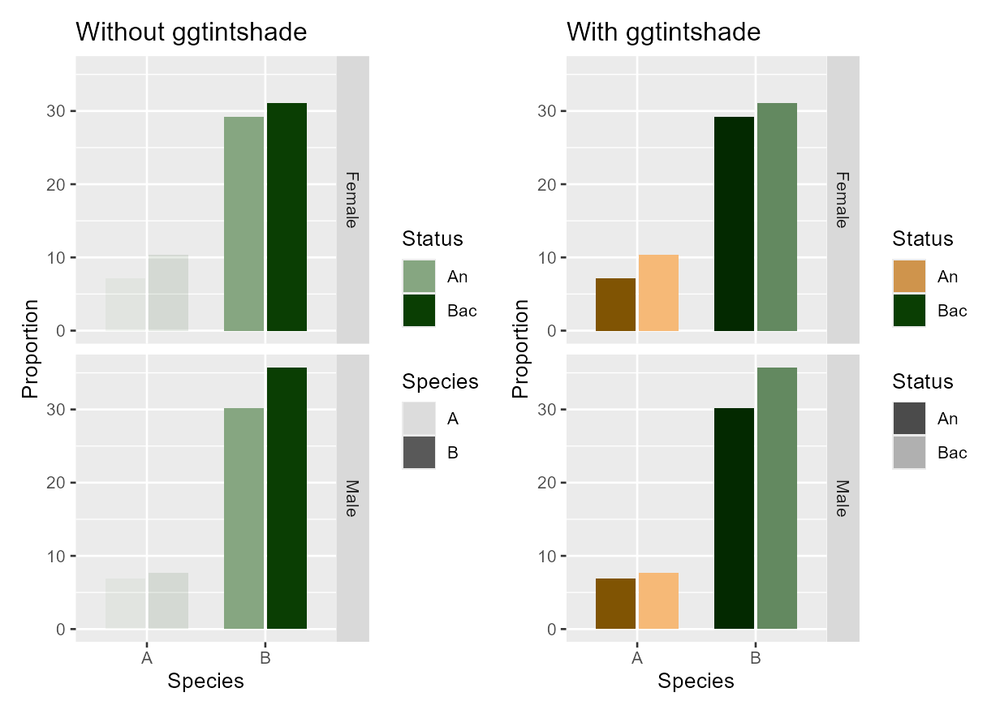
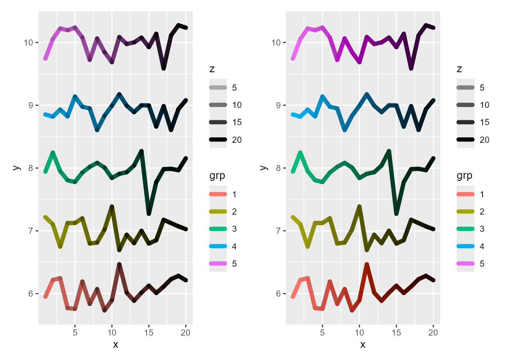
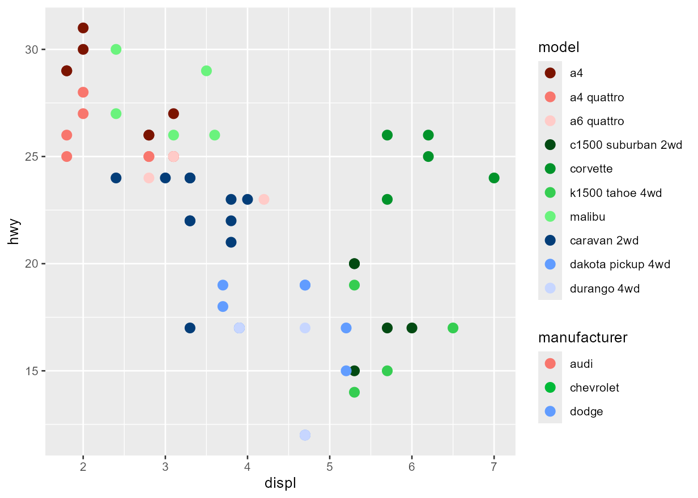
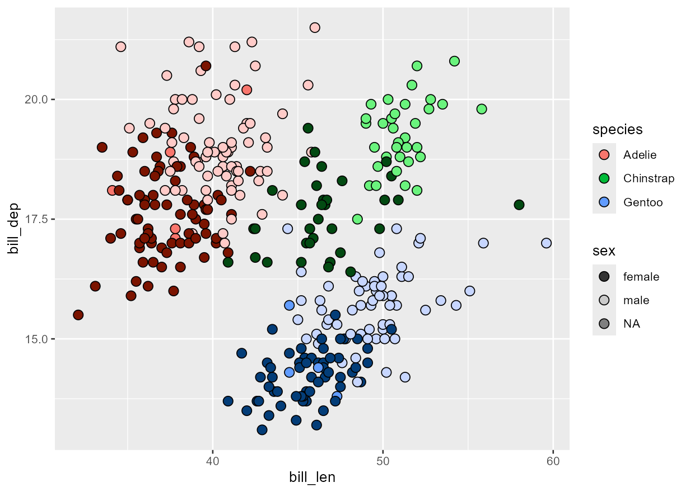

<!-- README.md is generated from README.Rmd. Please edit that file -->

# ggtintshade: Tinting/shading aesthetics for ggplot2

<!-- badges: start -->

[](https://github.com/wkumler/ggtintshade/actions/workflows/R-CMD-check.yaml)
[](https://app.codecov.io/gh/wkumler/ggtintshade)
<!-- badges: end -->

`ggtintshade` is an extension to the `ggplot2` plotting library that
allows for the tint/shade of a color to be mapped to an aesthetic in
addition to its hue. This permits visual grouping of similar points in
color space while still allowing a color legend to disambiguate them
overall. It supports both nested and crossed designs.

## Installation

You can install the most recent stable version of ggtintshade from CRAN
(soon!) as follows:

``` r
install.packages("ggtintshade")
```

Alternatively, you can install the development version from
[GitHub](https://github.com/wkumler/ggtintshade) with:

``` r
# install.packages("devtools")
devtools::install_github("wkumler/ggtintshade")
```

## Examples

### Crossed vs nested data

The original inspiration behind `ggtintshade` came from metabolomics
experiments where I wanted to be able to discuss both individual
compounds as well as the groups they fell into. A useful visual guide
for this is to have all of one compound type be a single color, while
individual compounds within that group have different shades.

``` r
library(ggtintshade)

metab_data <- data.frame(
  metab = rep(c("Alanine", "Threonine", "Glycine",
                "Glycine betaine", "Proline betaine", "Carnitine",
                "DMSP", "DMS-Ac", "Isethionate"), 3),
  metab_group = rep(rep(c("Amino acid", "Betaine", "Sulfur"), each = 3), 3),
  tripl = rep(c("A", "B", "C"), each = 9),
  area  = runif(27)
)
metab_data$metab <- factor(metab_data$metab, levels = unique(metab_data$metab))

ggplot(metab_data) +
  geom_col_tintshade(aes(x=tripl, y=area, fill=metab_group, tintshade = metab))
```



This is a nice example of **nested** data, where each individual entry
belongs to a single group. `ggtintshade` also handles **crossed** data,
where each shade should map into multiple groups. A good example of this
is your D&D-style “alignment” chart.

``` r
align_data <- data.frame(
  alignment=1:9,
  moral=rep(c("good", "neutral", "evil"), each=3),
  meta=rep(c("lawful", "neutral", "chaotic"), length.out=9)
)
align_data$moral <- factor(align_data$moral, levels=rev(unique(align_data$moral)))
align_data$meta <- factor(align_data$meta, levels=unique(align_data$meta))

ggplot(align_data) +
  geom_raster_tintshade(aes(x=meta, y=moral, fill=meta, tintshade=moral)) +
  scale_fill_manual(breaks = c("lawful", "neutral", "chaotic"), values=c("#cca40a", "#b52060", "#7623b2")) +
  coord_equal()
```



That last plot also demonstrates how well `ggtintshade` handles normal
`ggplot2` behavior. Manually specified colors are handled naturally and
the interaction is seamless, but you can also control the degree of
lightening/darkening using the expected `ggplot2` syntax for the new
aesthetic with the associated scale. For example, using the `diamonds`
dataset:

``` r
grp <- c(I1 = "I", SI2 = "SI", SI1 = "SI", VS2 = "VS", VS1 = "VS", VVS2 = "VVS", VVS1 = "VVS", IF = "IF")
diamonds$clarity_group <- factor(grp[as.character(diamonds$clarity)], levels = c("I", "SI", "VS", "VVS", "IF"))
mp <- aggregate(price ~ clarity + clarity_group, diamonds, mean)

crossed_gp <- ggplot(mp) +
  geom_col_tintshade(aes(clarity, price, fill = clarity_group, tintshade = clarity)) +
  scale_tintshade_discrete(range = c(0.4, 0.6)) +
  ggtitle("Nested diamonds") +
  theme(axis.text.x = element_text(angle=90, hjust=1, vjust=0.5))
nested_gp <- ggplot(diamonds) +
  geom_bar_tintshade(aes(x=cut, fill = cut, tintshade = clarity), color="black") +
  ggtitle("Crossed diamonds") +
  scale_tintshade_discrete(range = c(0.1, 0.9)) +
  theme(axis.text.x = element_text(angle=90, hjust=1, vjust=0.5))
crossed_gp + nested_gp
```



### Using tintshade instead of alpha

This package is a much better way to map a lightness aesthetic than the
advice commonly offered online to use `alpha` instead. (e.g
[here](https://stackoverflow.com/q/39239372),
[here](https://stackoverflow.com/q/50163072),
[here](https://stackoverflow.com/q/78775963) and
[here](https://albert-rapp.de/posts/ggplot2-tips/07_four_ways_colors_more_efficiently/07_four_ways_colors_more_efficiently.html))
For one, alpha only lightens, not darkens, and creates an unhelpful
transparency that must be handled. It also avoids having to calculate an
interaction and then set a manual scale for two aesthetics pasted
together. Additionally, using an overlapping alpha trace is inefficient
and can cause issues if exported to a vectorized format because each
point has multiple values.

For example, solving the question raised in [Different color shades for
faceted grouped bar plots in
ggplot2](https://stackoverflow.com/questions/76110170/different-color-shades-for-faceted-grouped-bar-plots-in-ggplot2):

``` r
temp.data = data.frame (
  Species  = rep(c("A","B"),each=2, times=2),
  Status = rep(c("An","Bac"), times=4),
  Sex = rep(c("Male","Female"), each=4, times=1),
  Proportion = c(6.86, 7.65, 30.13, 35.71, 7.13, 10.33, 29.24, 31.09)
)
init_alpha <- ggplot(temp.data, aes(x = Species, y = Proportion, fill = Status, alpha = Species)) +
  geom_bar(stat='identity', position = position_dodge(width = 0.73), width=.67) +
  facet_grid(Sex ~ .) +
  scale_fill_manual(name = "Status", labels = c("An","Bac"), values = c("#86a681","#0a3e03")) +
  ggtitle("Without ggtintshade")
new_tinted <- ggplot(temp.data, aes(x = Species, y = Proportion, fill = Species, tintshade = Status)) +
  geom_bar_tintshade(stat='identity', position = position_dodge(width = 0.73), width=.67) +
  facet_grid(Sex ~ .) +
  scale_fill_manual(name = "Status", labels = c("An","Bac"), values = c("#cf944c","#0a3e03")) +
  scale_tintshade_discrete(range = c(0.3, 0.7)) +
  ggtitle("With ggtintshade")
init_alpha + new_tinted
#> Warning: Using alpha for a discrete variable is not advised.
```



Or the question [here (grouping multiple gradients using
ggplot2)](https://stackoverflow.com/q/24617897) which also demonstrates
a continuous tint gradient (and why alpha is a bad idea when points
overlap!):

``` r
d <- data.frame(
  x=rep(1:20, 5), y=rnorm(100, 5, .2) + rep(1:5, each=20), 
  z=rep(1:20, 5), grp=factor(rep(1:5, each=20))
)

init_alpha <- ggplot(d) +
  geom_path(aes(x, y, color=grp), linewidth=2, lineend=0) +
  geom_path(aes(x, y, group=grp, alpha=z), linewidth=2, lineend=0) +
  ggtitle("Without ggtintshade")
new_tinted <- ggplot(d) + 
  geom_path_tintshade(aes(x, y, color=grp, tintshade=z), linewidth=2, lineend=0) +
  scale_tintshade_continuous(range = c(0.5, 0)) +
  ggtitle("With ggtintshade")
init_alpha + new_tinted
```



### Other examples:

``` r
mpgsub <- head(mpg, 60)
mpgsub$model <- factor(mpgsub$model, levels=unique(mpgsub$model))
ggplot(mpgsub, aes(displ, hwy, colour = manufacturer, tintshade = model)) +
  geom_point_tintshade(size = 3)
```



``` r
ggplot(penguins) + 
  geom_point_tintshade(aes(x=bill_len, y=bill_dep, fill=species, tintshade=sex), 
                       pch=21, color="black", size=3)
#> Warning: Removed 2 rows containing missing values or values outside the scale range
#> (`geom_point_tintshade()`).
```



This last example also shows how NA tintshade values are mapped to the
untinted shade, which could cause some confusion. The recommended
approach in this case is to ensure that the NA values are also mapped to
an additional aesthetic, e.g. shape.

## Internals

Internally, this is a bit of a hack. Base `ggplot2` treats each
aesthetic separately and does not like allowing them to interact in this
way. We get around this issue first by creating a cache that’s passed
around in the `ggproto` object and then we (ab)use the `use_defaults`
step where all the necessary information is available. For more details
about this, see the \[internals vignette\].

`ggtintshade` uses `colorspace::lighten` to actually modify the colors,
so review the documentation there for more information about how the
color values are remapped.

The individual geoms are generated via a factory \[R/geoms.R\] instead
of copy-pasting code, so adding new geoms isn’t difficult as long as
they inherit naturally from an existing `ggplot2` function.

## Footnote

Issues: <https://github.com/wkumler/ggtintshade/issues>

README last built on 2026-07-15
